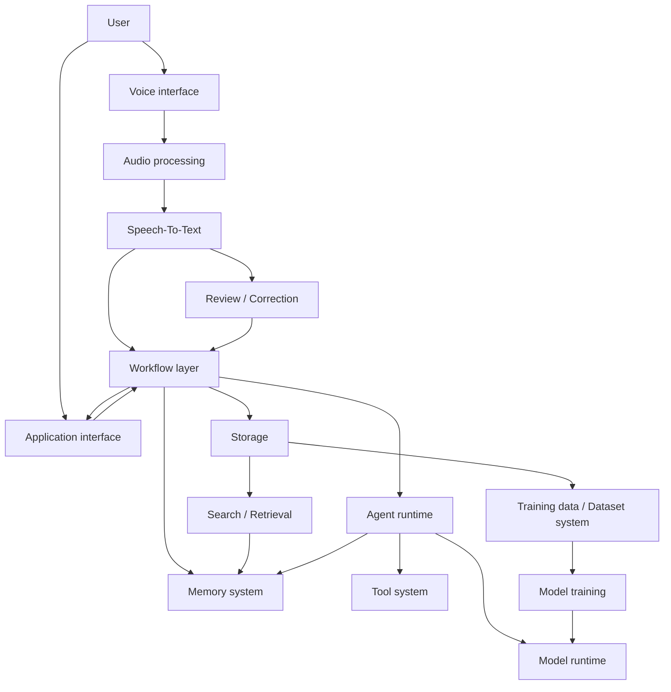
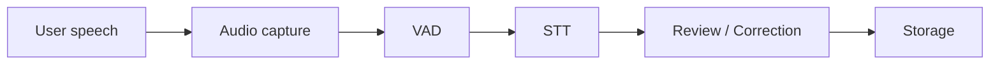
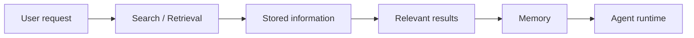
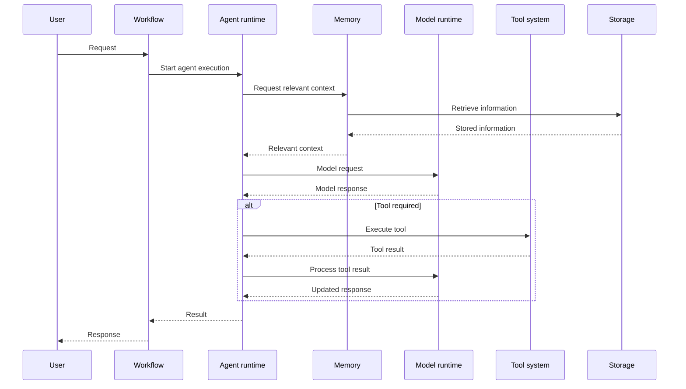
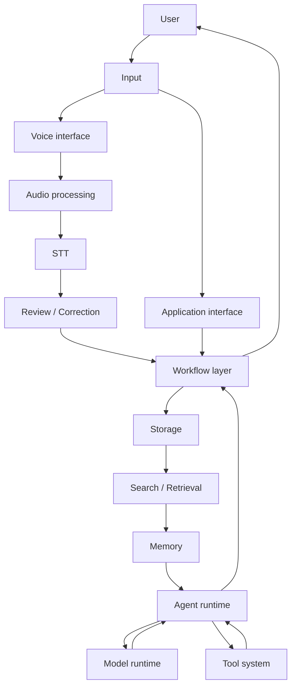

# ODEN Architecture

[← Back to README](../README.md)

## 1. Purpose

This document defines the initial high-level architecture of ODEN and establishes the major system components, their responsibilities, relationships, and primary data flows.

ODEN is intended to become a highly personalized local system. The architecture therefore prioritizes:

- Local execution and data ownership
- Clear separation of responsibilities/conserns
- Replaceable components
- Explicit data flows
- Minimal coupling between subsystems
- The ability to evolve as ODEN's capabilities grow

This document describes architectural boundaries rather than specific technologies or implementations. Individual components may be replaced or redesigned without requiring changes to the overall architecture.

---

## 2. Architectural principles

The initial architecture follows these principles:

### Local-first

User data, audio, transcripts, memory, and other personal information should be processed and stored locally whenever practical.

### Modular

Major capabilities should be separated into distinct components with well-defined responsibilities and interfaces.

### Replaceable

Components such as STT engines, LLMs, storage systems, and model implementations should be replaceable without requiring a redesign of unrelated components.

### Data-driven

Persistent information should have explicit ownership, structure, and relationships between related data.

### Workflow-oriented

Complex operations should be represented as workflows composed of smaller components rather than implemented as tightly coupled monolithic operations.

### Technology-agnostic

The architecture should define what components do and how they interact without prematurely selecting specific frameworks, libraries, models, or vendors.

---

# 3. High-level component design

At a high level, ODEN consists of several interconnected subsystems.



The diagram represents the intended architectural relationships rather than a fixed implementation.

Not every operation will pass through every component. The workflow layer coordinates the components required for a particular operation.

---

# 4. Core components
This section defines ODEN’s core subsystems. 
Each subsystem should be independent replaceable, and coordinated exclusively by the Workflow layer. (**//TODO make clearer its for backend !useraudio + ev. add link?**)
No component assumes knowledge of any other component’s internal behavior.


## 4.1 Voice interface

The Voice Interface is ODEN’s user-facing voice interaction surface.
It does not perform speech recognition, audio processing, or text generation.
It simply manages the experience of speaking with ODEN.

### Responsibilities

- Capture audio from the user 
- Deliver TTS-generated audio to the user
- Manage conversational turn-taking
- Forward captured audio to Audio Processing
- (Forward STT results (once available) to the Workflow Layer) (**TBD**)

### Inputs

- User voice/audio

### Outputs

- Audio for processing
- (Text produced by speech recognition) (**TBD**)
- Audio generated by text-to-speech


#### Notes 
The Voice interface does not produce text. It only exposes text produced by STT to the user-facing application layer. 
The Voice interface should not contain the implementation details of STT, VAD, or TTS. Those capabilities should remain separate components.
(**TBD**)

---

## 4.2 Audio processing

Audio processing prepares raw audio for speech recognition.

### Responsibilities
- Normalize and clean raw audio
- Perform Voice Activity Detection (VAD)
- Segment speech into processable chunks
- Provide audio metadata (eg. timing and energy metadata)
- Forward speech segments to STT


### Inputs

- Raw audio from the voice interface

### Outputs

- Speech segments
- Processed audio
- Audio metadata


#### Notes
Audio Processing does not interpret speech.
It only prepares audio for STT.\
Voice Activity Detection (VAD) is considered part of the audio-processing pipeline.

---

## 4.3 Speech-to-Text
STT converts speech segments into text.
### Responsibilities

- Accept speech segments
- Produce transcripts (streaming or batch)
- Provide transcription metadata (confidence, timestamps)
- Expose a replaceable interface for different STT implementations

### Inputs

- Speech segments from Audio processing

### Outputs

- Transcript
- Transcription metadata


#### Notes
STT is the only component that produces text from audio. STT does not store transcripts or perform corrections. (The architecture should not depend on a particular STT engine.)(**TBD**)

---

## 4.4 Review / Correction

The Review / Correction component allows generated transcripts to be inspected and corrected before they become trusted stored information.


### Responsibilities

- Apply automatic corrections (punctuation, grammar, domain normalization) (**TBD** if this should be implemented)
- Present generated transcripts for review
- Allow optional manual corrections
- Track corrected transcript content
- Indicate whether a transcript has been reviewed

### Inputs

- Raw transcript
- Associated audio (optional)

### Outputs

- Corrected transcript
- Review status


#### Notes
This component is primarily part of the recording/journaling workflow rather than an independent processing engine. The component does not store data, Storage (**TBD** link?)handles persistence.

---

## 4.5 Storage

Storage provides persistent data storage for ODEN.

### Responsibilities

- Persist audio, transcripts, metadata
- Maintain relationships between stored related items
- Provide data retrieval and persistence interfaces
- Store system-level datasets and training data (**TBD**)


Potential stored data includes:

- Audio recordings
- Audio segments
- Raw transcripts
- Corrected transcripts
- Metadata
- Memory-related information
- Training data
- System state

### Inputs
- Data from Workflow Layer

### Outputs
- Persisted records
- Data for Search / Retrieval


#### Notes
The architecture should not require a specific database or storage technology at this stage. Storage does not interpret or contextualize data and is purely a persistence layer.

---

## 4.6 Search / Retrieval

Search / Retrieval locates relevant information in Storage(**TBD** link?).

### Responsibilities
- Execute search queries for transcripts and other stored information
- Retrieve relevant records
- Provide ranked or filtered results
- Provide relevant information to the Memory and Agent systems
- Support future semantic and embedding-based retrieval


### Inputs

- Search queries
- Retrieval requests

### Outputs

- Matching records
- Relevant context


#### Notes
The retrieval implementation may evolve from basic textual search to more advanced retrieval methods. 

---

## 4.7 Memory system

The Memory system provides the Agent runtime with relevant information derived from ODEN's persistent data.

### Responsibilities

- Select and organize relevant information for current tasks
- Maintain short-term and long-term memory structures
- Retrieve or assemble contextual information
- Provide contextual bundles to the Agent runtime and workflows
- Manage the relationship between persistent data and active memory
 

Memory is conceptually distinct from Storage.

**Storage answers:** "Where is the information persisted?"

**Memory answers:** "What information should ODEN use as context?"

The Memory System may use Search / Retrieval and Storage as underlying services.


### Inputs
- Retrieved records from Search
- Workflow requests for context

### Outputs
- Contextualized memory objects
- Relevant information for agents

#### Notes
Memory does not store data, Storage does and does not execute tasks, Agent runtime does.

---

## 4.8 Agent runtime
The Agent runtime executes reasoning and task logic.


### Responsibilities
- Interpret tasks and goals
- Request context/information from Memory
- Invoke tools
- Interact with the Model runtime (**TBD** link?)
- Produce results or actions
- Execute multi-step reasoning within a single workflow step
- Execute agent workflows
- Decide which capabilities are required

### Inputs
- Context from Memory
- Workflow instructions
- Model outputs
- Tool results

### Outputs
- Agent actions
- Final results for Workflow Layer

#### Notes
The Agent runtime should not directly implement individual tools or models. Workflow orchestrates macro operations, Agent handles micro reasoning. Agents do not store data or manage memory directly.

---

## 4.9 Model runtime

The Model Runtime provides access to machine-learning models used by ODEN.

### Responsibilities

- Provide model inference
- Manage model interfaces and configuration
- Support different model types where required
- Abstract model implementations from agents, workflows and/or other components
- Support streaming and batching


Potential model types include:

- Language models
- Embedding models
- Speech models
- Other specialized models

### Inputs
- Prompts or inference requests from Agent runtime

### Outputs
- Model outputs (text, embeddings, classifications)

#### Notes
The architecture should allow individual models to be replaced without changing the components that consume them. Speech models (STT/TTS) are external services and not part of the Model runtime. Model runtime does not store or train models.


---

## 4.10 Tool system

The Tool system provides controlled access to capabilities that are external to the core agent reasoning process.


### Responsibilities

- Define available tools
- Provide standardized tool interfaces
- Validate tool requests
- Execute tool requests
- Return tool results to the Agent runtime
- Enforce safety and access restrictions where necessary

### Inputs
- Tool invocation requests from Agent runtime

### Outputs
- Tool results

#### Notes
Tools are only invoked by agents. Tools do not interact directly with Storage or Memory. Tools may eventually provide capabilities such as file operations, system interaction, data processing, or other local functionality. **The initial architecture does not prescribe which tools will exist.**

---

## 4.11 Workflow layer
The Workflow layer is ODEN’s **only** orchestrator and coordinates operations involving multiple ODEN components.


### Responsibilities
- Coordinate multi-step operations across components
- Define execution order
- Pass data between components
- Handle workflow state
- Provide reusable workflows (voice journaling, agent tasks, etc.)

### Inputs
- User requests (via Voice interface or API)
- Component outputs

### Outputs
- Final results
- Component invocation sequences


For example, the voice-journaling workflow can coordinate:

```text
Audio Capture
    ↓
VAD
    ↓
STT
    ↓
Review / Correction
    ↓
Storage
```
without requiring the STT component to know anything about storage or user interfaces.

Or:
Exampel of a Voice journaling workflow:
```text
Voice Interface
    ↓
Audio Processing
    ↓
STT
    ↓
Review / Correction
    ↓
Storage

```
#### Note
**The Workflow Layer prevents individual components from becoming tightly coupled to every other component.**Components remain independent and unaware of each other. Workflow ensures correct sequencing.

---

## 4.12 Application interface

The Application interface provides a general interface through which ODEN applications or clients can interact with the system.

### Responsibilities

- Accept application requests

- Expose ODEN functionality
- Validate requests
- Forward requests to appropriate workflows
- Return results

### Inputs
- Application requests

### Outputs
- Workflow results

#### Notes
The exact interface mechanism (REST, gRPC, etc.) is intentionally unspecified and undefined at this stage.


---

## 4.13 Dataset system

The Dataset system manages structured training data derived from ODEN’s reviewed content.

### Responsibilities

- Identify eligible audio/transcript pairs
- Generate structured training examples
- Track dataset versions
- Provide datasets to model-training processes


### Inputs
- Reviewed transcripts
- Associated audio
- Metadata from Storage

### Outputs
- Structured datasets
- Dataset metadata

#### Notes
Training data generation should be based on explicitly eligible and appropriately reviewed data. Dataset generation is optional and offline. 

---

## 4.14 Model training

The Model training subsystem is responsible for training or adapting models using ODEN's datasets.

### Responsibilities

- Consume prepared datasets
- Execute training or fine-tuning processes
- Produce model artifacts
- Track training metadata
- Provide trained models to the Model runtime

### Inputs
- Datasets from Dataset system

### Outputs
- Trained model artifacts

#### Notes
Model training is separated from model inference so that training processes do not become a dependency of normal ODEN execution. 

---

# 5. System relationships

The major relationships between components are:

```text
Voice interface
      │
      ▼
Audio processing
      │
      ▼
STT
      │
      ▼
Review / Correction
      │
      ▼
Workflow layer
      │
      ▼
Storage
      │
      ├──────────────► Search / Retrieval
      │                       │
      │                       ▼
      │                    Memory
      │                       │
      │                       ▼
      │                 Agent runtime
      │                  │         │
      │                  ▼         ▼
      │              Model      Tools
      │              runtime
      │
      └──────────────► Dataset system
                              │
                              ▼
                        Model training
                              │
                              ▼
                        Model runtime
```

The relationships describe logical dependencies. They do not necessarily imply direct communication between components.

For example, an Agent should normally access stored information through Memory rather than directly querying the underlying storage implementation.

---

# 6. Main data flows

## 6.1 Voice journal flow

The initial voice-journaling flow is:



The resulting relationship between audio and transcript should be preserved so that the original recording can be associated with its transcript.

---

## 6.2 Search and Memory flow



The exact retrieval strategy is intentionally unspecified.

---

## 6.3 System/Agent execution flow



This flow represents the expected execution model and may change as the Agent runtime develops.

---

# 7. End-to-End data flow

A simplified end-to-end representation of ODEN is:



This is the primary conceptual architecture for the initial implementation phases.

---

# 8. External dependencies

ODEN is intended to minimize unnecessary external dependencies, but several categories of external or replaceable dependencies may exist.

| Dependency | Purpose | Architectural Constraint |
|---|---|---|
| Audio hardware | Microphone / audio output | Accessed through audio interfaces |
| STT implementation | Speech recognition | Must be replaceable |
| TTS implementation | Speech synthesis | Must be replaceable |
| LLM implementation | Language reasoning | Must be replaceable |
| Embedding/model implementation | Retrieval or other ML functionality | Must be replaceable |
| Database/storage implementation | Persistent data | Abstracted behind storage interfaces |
| Operating system | Local execution environment | Platform-specific functionality should be isolated |
| ML/training frameworks | Model training | Should not define the core architecture |

External dependencies should be isolated behind component boundaries where practical.

ODEN should avoid making the core architecture dependent on a specific commercial service or model provider.

---

# 9. Component dependency boundaries

The following boundaries should be maintained during implementation:

- **STT** should not depend directly on Storage.
- **Storage** should not depend on a specific STT or LLM implementation.
- **Memory** should not require knowledge of the underlying storage implementation.
- **Agent runtime** should not contain individual tool implementations.
- **Agent runtime** should interact with models through the Model runtime abstraction.
- **Workflows** should coordinate components rather than reimplement their responsibilities.
- **Dataset generation** should consume defined data interfaces rather than depend on internal storage structures.
- **Model training** should remain separate from normal inference and runtime execution.

These boundaries are intended to reduce coupling and make individual components replaceable.

---

# 10. Initial architecture scope

This architecture is intentionally incomplete in several areas.

The following are **not yet defined**:

- Specific database technology
- Specific STT model
- Specific TTS model
- Specific LLM
- Specific embedding model
- Specific agent framework
- Specific API protocol
- Specific UI implementation
- Specific deployment architecture
- Detailed security architecture
- Detailed concurrency model

These decisions should be made when they become necessary for implementation and should remain consistent with the architectural principles defined in this document. This list should also be updated accordenly.  

---

# 11. Architectural evolution

This document represents the **initial architecture baseline** for ODEN.

As implementation progresses, architectural decisions may be refined based on:

- Performance requirements
- Resource constraints
- Hardware limitations
- Model capabilities
- User workflows
- Reliability requirements
- Security requirements
- Lessons learned during implementation

Changes to major component boundaries or dependencies should be documented when they materially affect the architecture.

The architecture should evolve with the system rather than attempting to predict all future requirements in advance.

[← Back to README](../README.md)