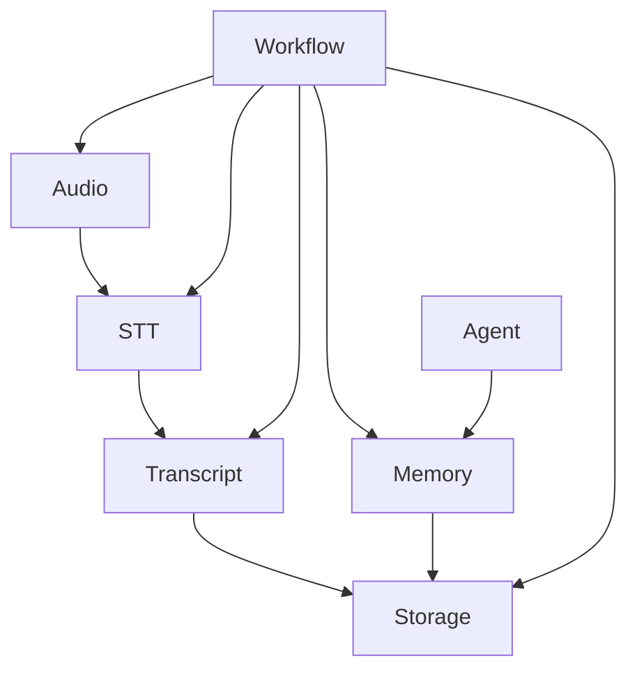

# ODEN Interfaces
[← Back to  ODEN Architecture](../architecture.md)

## Purpose

This directory defines the public interfaces between ODEN's major subsystems. Interfaces establish the contracts that components use to communicate without depending directly on specific implementations.

The interfaces describe **what a component provides or requires**, not **how it is implemented**.

---

## Interface documentation

| Interface  | Purpose                                               | Documentation                         |
| ---------- | ----------------------------------------------------- | ------------------------------------- |
| Audio      | Provides processed audio data to consumers            | [Audio interface](audio.md)           |
| STT        | Converts audio into text                              | [STT interface](stt.md)               |
| Transcript | Represents and manages transcript data                | [Transcript interface](transcript.md) |
| Storage    | Provides persistent data storage                      | [Storage interface](storage.md)       |
| Memory     | Provides contextual information and memory operations | [Memory interface](memory.md)         |

---

## Component Dependencies

The following relationships describe which interfaces components **may** depend on.

These dependencies describe architectural relationships rather than specific implementation dependencies.

A component should depend on an interface rather than on a concrete implementation whenever an interface exists.

---

## Interface design principles

### Implementation independence

Interfaces must not expose implementation-specific details such as:

* Specific libraries or frameworks
* Concrete storage technologies
* Specific models or model architectures
* Internal data structures that consumers do not need
* Internal processing steps

### Explicit contracts

Each interface should clearly define:

* Its responsibility
* Inputs
* Outputs
* Expected behavior
* Errors or failure conditions, where relevant
* Dependencies on other interfaces

### Stable boundaries

Changes to an implementation should not require changes to consumers as long as the public interface contract remains compatible.

### Scope

These documents define ODEN's architectural interfaces at a technology-independent level.

Language-specific types, classes, function signatures, and other implementation details should be defined in the corresponding source code when implementation begins.

[← Back to  ODEN Architecture](../architecture.md)
